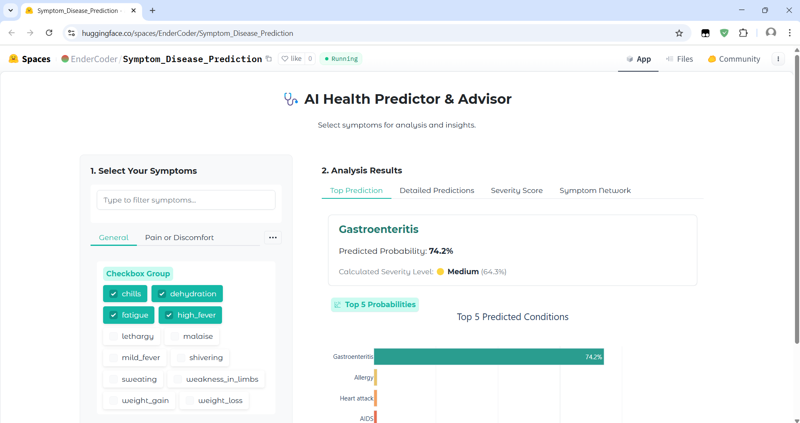

# AI Health Predictor & Advisor

This project implements a machine learning model to predict potential health conditions based on user-selected symptoms. It features a Gradio web interface for easy interaction.



## Project Structure

```
.
├── .gitignore
├── README.md             # This file
├── requirements.txt      # Project dependencies
├── app/                  # Contains the Gradio web application
│   ├── main.py           # Main Gradio application script
│   ├── README.md         # App-specific README
│   ├── requirements.txt  # App-specific requirements (if any)
│   ├── assets/           # Static assets (CSVs, joblib, etc.) used by the app
│   │   ├── processed/
│   │   └── raw/
│   ├── models/           # Location for saved models used by the app
│   ├── old_version/      # Older versions of the application
│   └── pages/            # Gradio pages/modules (multi-page app structure in progress)
├── catboost_info/        # Output files from CatBoost training
├── data/                 # Data files used for training and analysis
│   ├── data_cleaning/    # Notebooks related to data cleaning
│   ├── interim/          # Intermediate data files
│   ├── processed/        # Cleaned or transformed data 
│   └── raw/              # Original, unmodified data
├── docs/                 # Documentation files
├── models/               # Saved machine learning models from experiments
│   ├── Ensemble/
│   ├── Gradient_Boosting/
│   ├── Logistic_Regression/
│   ├── Naive_Bayes/
│   ├── Random_Forest/
│   └── SVM/
├── notebooks/            # Jupyter notebooks for experimentation and analysis
│   ├── data_cleaning/    # old file use for cleaning
│   ├── Ensemble/         # Version 1 Ensemble we tried (Overfitted)
│   ├── Ensemble_SMOTE/   # Ensemble Soft Vote + SMOTE (Not Overfit)
│   ├── Ensamble_Soft_voting/ #Ensemble V2 we tried
│   ├── Logistic_Regression_Abs_Coefficient/   # LR + Abs Coefficient Feature Selection
│   ├── Logistic_Regression_PCA/               # LR + PCA Feature Selection
│   ├── Logistic_Regression_SMOTE/             # LR + SMOTE Feature Selection
│   ├── Naive baye/                            # Naive bayes with default dataset
│   ├── Naive_Bayes_Agumented_Data/            # Naive Bayes with Agumented data
│   ├── Random_Forest/                         # Random Forest with no Feature Select
│   ├── Random_Forest_SMOTE/                   # Random Forest + SMOTE
│   ├── Random_Forest(17_Features)/            # RF instead of 131 we tried 17 columns
│   ├── SVM/                                   # Support Vector Machine + Feature Sele
│   ├── catboost_info/    
│   ├── compare_model.ipynb                    # We only compare a few models
│   └── EDA.ipynb                              # EDA on all 4 datasets
├── reports/                                   # Project reports and figures
│   └── figures/                               # Some visual that got save
```

## Setup

1.  **Clone the repository (if you haven't already):**
    ```bash
    git clone https://github.com/pheakleap/Capstone-Project-I.git
    cd Capstone-Project-I
    ```

2.  **Create a virtual environment (recommended):**
    ```bash
    python -m venv venv
    ```
    *   On Windows: `venv\Scripts\activate`
    *   On macOS/Linux: `source venv/bin/activate`

3.  **Install dependencies (Some Requirement still need to be manually install):**
    ```bash
    pip install -r requirements.txt
    ```

## Running the Gradio Application

The main application is located in the `app/` directory.

1.  **Navigate to the `app` directory:**
    ```bash
    cd app
    ```

2.  **Run the `main.py` script:**
    ```bash
    python main.py
    ```

3.  This will start the Gradio server. Open your web browser and go to the local URL provided in the terminal output (usually `http://127.0.0.1:7860` or similar). A public URL might also be provided if `share=True` is enabled in the script. But we have hosted this on the Hugging Face Space, Here is the Link: https://huggingface.co/spaces/EnderCoder/Symptom_Disease_Prediction

## Notebooks Overview

The `notebooks/` directory contains various Jupyter notebooks used for data exploration, preprocessing, model training, and evaluation. They are organized into subdirectories based on the models or techniques explored:

*   **`data_cleaning/`**: Notebooks related to cleaning and preparing the raw data.
*   **`EDA.ipynb`**: Exploratory Data Analysis.
*   **`Ensemble/`, `Ensemble_SMOTE/`, `Ensamble_Soft_voting/`**: Experiments with ensemble modeling techniques (potentially with SMOTE for handling class imbalance).
*   **`Logistic_Regression_Abs_Coefficient/`, `Logistic_Regression_PCA/`, `Logistic_Regression_SMOTE/`**: Experiments using Logistic Regression, potentially exploring different feature selection/engineering methods like PCA or SMOTE.
*   **`Naive_Baye/`, `Naive_Bayes_Agumented_Data/`**: Experiments using Naive Bayes classifiers.
*   **`Random_Forest/`, `Random_Forest_SMOTE/`, `Random_Forest(17_Features)/`**: Experiments using Random Forest classifiers, potentially with SMOTE or specific feature sets.
*   **`SVM/`**: Experiments using Support Vector Machine classifiers.
*   **`compare_model.ipynb`**: Notebook likely used for comparing the performance of different models.

**⚠️ Important Note on Notebooks:** These notebooks represent experiments and analyses conducted by various team members. Due to potential Git conflicts and differing local setups during development, **file paths within the notebooks may be incorrect or broken.** Furthermore, many notebooks might primarily contain final results, visualizations, or code snippets rather than fully reproducible, end-to-end pipelines. 


**It is strongly recommended to view these notebooks for reference and understanding the methodology/results only. Do NOT attempt to re-run them directly, as they are unlikely to execute correctly without significant path adjustments and potential code modifications.** Review individual notebooks for specific insights, but rely on the main `app/` for the functional prediction tool.
